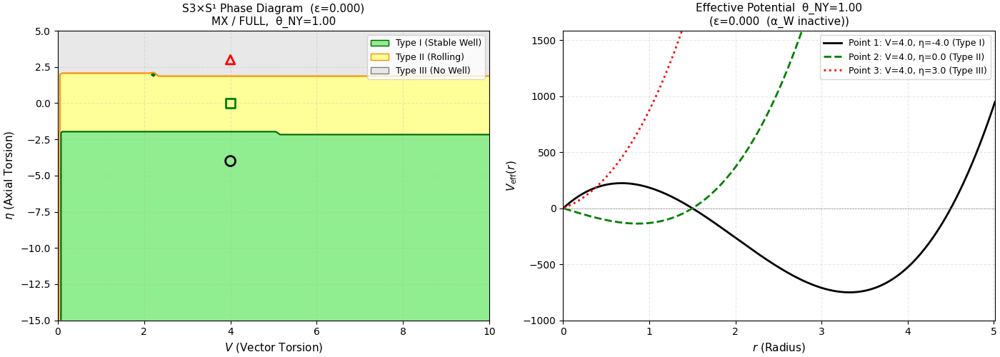
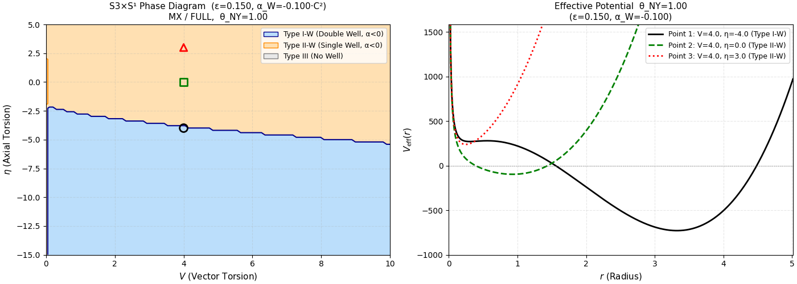
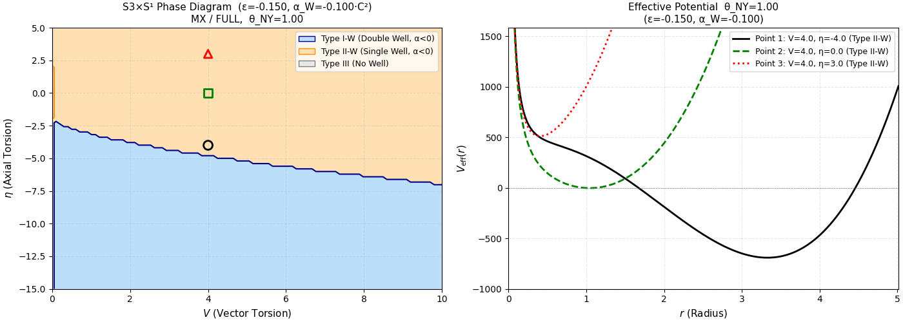
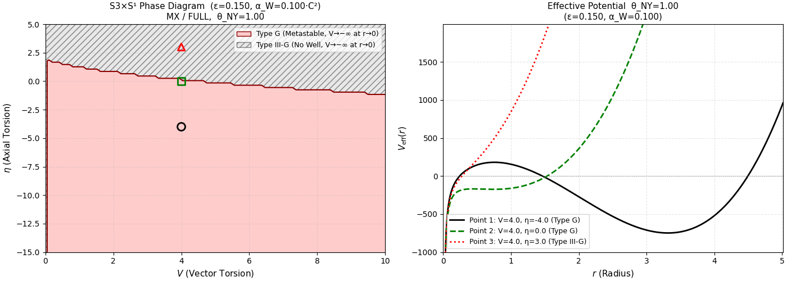
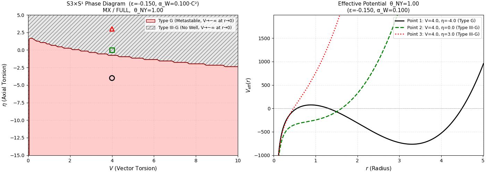

## Appendix D: Phase Atlas — $(\alpha_W, \varepsilon)$ パラメータ空間における有効ポテンシャルと相図

本付録では、Weyl 結合定数 $\alpha_W$ と異方性パラメータ $\varepsilon$ の代表的な5ケースについて、有効ポテンシャル $V_{\rm eff}(r)$ の形状と $S^3 \times S^1$ 相図がどのように変化するかを示す図08〜12 を体系的に解説する。これらの図は本文の定理1・定理2・定理3の視覚的裏付けをなす。

各図は左パネルに $(V, \eta)$ 平面上の相図（$\theta_{NY} = 1.00$、MX/FULL モード固定）、右パネルに3代表点の有効ポテンシャル $V_{\rm eff}(r)$ を示す。代表点は相図上で $V = 4.0$ 固定のまま $\eta$ を変え、各相領域に1点ずつ選んでいる（$\circ$: 安定井戸相、$\square$: 中間相、$\triangle$: 井戸なし相）。

---

### D.1 Baseline: $\alpha_W = 0$, $\varepsilon = 0$（図08）

$\alpha_W = 0$（Weyl 項不活性）、$\varepsilon = 0$（等方的 $S^3$）の場合。paper I の3相構造を完全に再現し、エンジン v4 の後方互換性を確認するためのリファレンスケースである。

**相図の特徴:**
- **Type I（Stable Well、緑）**: $\eta \lesssim -2.5$ の領域。大域的安定最小を持つ有効ポテンシャルが存在する。
- **Type II（Rolling、黄）**: $-2.5 \lesssim \eta \lesssim 2.3$ の領域。$r \rightarrow 0$ の障壁を持たず、ポテンシャルが「ローリング」する。
- **Type III（No Well、灰）**: $\eta \gtrsim 2.3$ の領域。有効ポテンシャルに井戸が存在しない。

**有効ポテンシャルの特徴:**
- Point 1（$\eta = -4$、Type I）: 井戸型。$r \approx 3$ 付近に深い大域最小を持ち、$r \rightarrow 0$ で高障壁を形成する。$r \to \infty$ で発散。等方的 $S^3$ 真空の典型形。
- Point 2（$\eta = 0$、Type II）: $r \approx 1$ 付近に極小は残るが、 $r \rightarrow 0$ の障壁は消失する。
- Point 3（$\eta = 3$、Type III）: 単調増加型。$r$ に依らず井戸構造が形成されない。

---

### D.2 Weyl 安定領域: $\alpha_W < 0$（図09, 図10）

$\alpha_W < 0$ では定理1により Weyl 項が異方性方向のペナルティとして機能し、等方的真空 $(\varepsilon = 0)$ を保護する。本節では $\varepsilon$ の符号の違いが相境界にどう影響するかを示す。この領域では、Type I と Type II が、$\alpha_W < 0$ に特有の下位分類 **Type I-W**（Double Well）と **Type II-W**（Single Well）に細分される。

#### D.2.1 $\alpha_W = -0.100$, $\varepsilon = +0.150$（図09）

**相図の特徴:**
- **Type I-W（Double Well、青）**: 斥力芯近傍の極小点と、大域的安定最小を持つダブルウェル型ポテンシャルを持つ広大な安定領域。$\eta \lesssim -2.5$ の領域で形成される。
- **Type II-W（Single Well、橙）**: 相図上部（$\eta \gtrsim -2.5$ 付近）。シングルウェル型ポテンシャルに対応。

**有効ポテンシャルの特徴:**
- Point 1（$\eta = -4$、Type I-W）: 二重井戸型。$r \rightarrow 0$ に局所的極大（ポテンシャル障壁）が現れ、斥力芯との間に極小点、その外側（$r \approx 3$ 付近）に深い大域最小が存在する。Weyl 補正が $r \to 0$ 方向への崩壊を防ぐ障壁として機能していることを示す。
- Point 2（$\eta = 0$、Type II-W）: シングルウェル型。$r \rightarrow 0$ にポテンシャル障壁は消失し、斥力芯の外側、$r \approx 1$ 付近にひとつの明瞭な最小を持つ。
- Point 3（$\eta = 3$、Type II-W）: Point 2 と同様のシングルウェル型。 $\varepsilon = 0$ ではType IIIだったものが、斥力芯で最小を持つようになったもの。

図09は、$\alpha_W < 0$ かつ $\varepsilon > 0$ の組み合わせが最も広い Type I-W 領域を生成し、安定真空を強く支持することを示す。

#### D.2.2 $\alpha_W = -0.100$, $\varepsilon = -0.150$（図10）

**相図の特徴:**
- 図09 と同じく Type I-W（青）と Type II-W（橙）の二相構造だが、Type I-W（二重井戸）領域が図09 に比べて縮小し、相境界が低 $\eta$ 側へシフトしている。

**有効ポテンシャルの特徴:**
- 全3点が Type II-W（シングルウェル）型。図09 の Point 1 で見られたポテンシャル障壁が消失し、ポテンシャルは単一の極小へ向かってなだらかに降下する。
- $\varepsilon$ の符号が正から負に変わることで、Type I-W 領域の占有が非対称に縮小する。これは Weyl スカラー $C^2 \propto \varepsilon^2(\varepsilon+2)^2 / r^4$ の $\varepsilon$ 依存性が $\varepsilon \leftrightarrow -\varepsilon$ に対して対称でないことに対応する。

---

### D.3 Weyl 不安定領域: $\alpha_W > 0$（図11, 図12）

$\alpha_W > 0$ では定理2により $V_{\rm eff}(r, \varepsilon; \alpha_W) \to -\infty$（$r \to 0^+$）が保証され、大域的安定最小が存在しない。相図においてこの挙動を示す相を **Type G**（Ghost / Metastable）と定義する。Type G は $r \to 0$ における発散のせいで準安定的な有限スケールの最小を持ちうるが、真の大域最小は存在しない。

#### D.3.1 $\alpha_W = +0.100$, $\varepsilon = +0.150$（図11）

**相図の特徴:**
- **Type G（Metastable、赤）**: 相図の $\eta \lesssim 2$ 付近より下を占める。
- **Type III-G（No Well、灰）**: 相図上部（$\eta \gtrsim 2$）。
- 安定井戸領域（Type I / Type II / Type I-W / Type II-W）は完全に消滅しており、$\alpha_W > 0$ が安定真空を根本的に破壊することが視覚的に確認できる。

**有効ポテンシャルの特徴:**
- Point 1（$\eta = -4$、Type G）: $r \to 0^+$ で $V_{\rm eff} \to -\infty$。有限 $r$ 付近に準安定的な局所最小の名残が見えるが、真の大域最小は $r = 0$ に向かって無限大に降下する。これは定理2の直接的な数値確認である。
- Point 2（$\eta = 0$、Type G）: 同様に $r \to 0^+$ で $V_{\rm eff} \to -\infty$。
- Point 3（$\eta = 3$、Type III-G）: $r$ に対し、単調増加型。もともと Type III だったものが、 $r \to 0^+$ で $V_{\rm eff} \to -\infty$ となる。

#### D.3.2 $\alpha_W = +0.100$, $\varepsilon = -0.150$（図12）

**相図の特徴:**
- 図11 と本質的に同じ二相構造（Type G + Type III-G）。$\varepsilon$ の符号が負になっても、$\alpha_W > 0$ による不安定化の構造は変化しない。
- 相境界は図11 と比較してわずかに移動するが、Type G の支配は維持される。

**有効ポテンシャルの特徴:**
- Point 1（$\eta = -4$、Type G）: $r \to 0^+$ で $V \to -\infty$。図11 と同様の崩壊挙動を示す。
- Point 2（$\eta = 0$、Type III-G）: 図11 では Type G だったが、$\varepsilon < 0$ への変化により Type III-G へ移行。
- Point 3（$\eta = 3$、Type III-G）: 単調増加型。

$\varepsilon$ の符号に関わらず $\alpha_W > 0$ が一様に不安定性を引き起こすことは、定理3（$\alpha = 0$ 安定境界の普遍性）と整合する。

