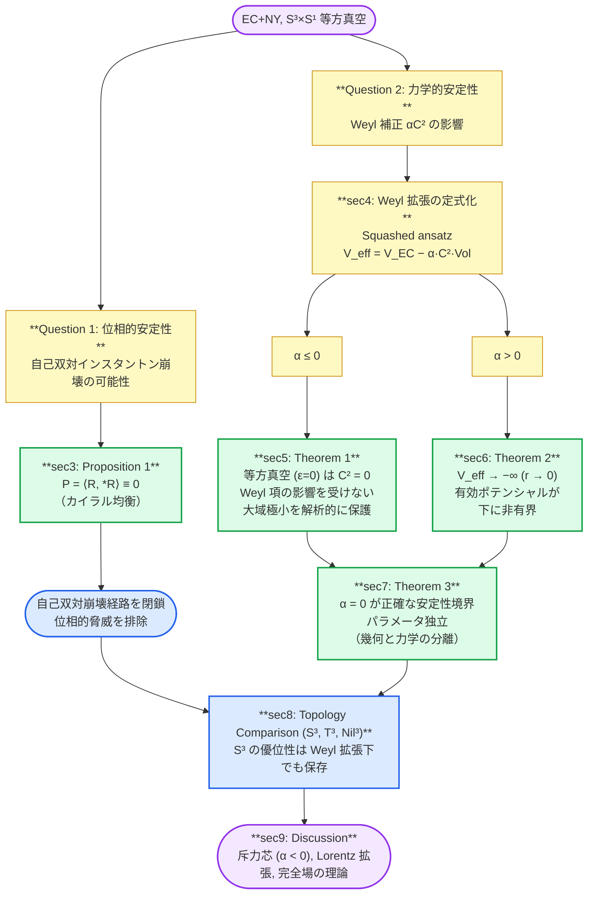

# Structural Robustness of Isotropic S³ Vacua in Einstein-Cartan Minisuperspace via Chiral Equilibrium and Weyl Stability
カイラル平衡とワイル安定性によるアインシュタイン-カルタンMinisuperspaceにおける等方性S³真空の構造的堅牢性

## Abstract

本論文は私たちの研究成果である "Topology-Dependent Phase Classification of Effective Potentials in Einstein–Cartan + Nieh–Yan Minisuperspace" （以降 "paper01" と呼称）[1] において確立された Einstein-Cartan + Nieh-Yan (EC+NY) minisuperspace の $S^3 \times S^1$ 等方真空に対し、位相的（自己双対経路）および力学的（高次曲率補正）に独立な2つの拡張を行い、その頑健性（Robustness）を解析的・数値的に示す。

第一に、 $M^3 \times S^1$ minisuperspace ansatz の下でポントリャーギン密度 $P = \langle R, *R \rangle$ が恒等的にゼロとなること（これを「カイラル均衡（Chiral Equilibrium）」と呼ぶ）を示し、この ansatz の下で自己双対インスタントンを通じた真空崩壊経路が閉鎖されることを示す（Proposition 1）。

第二に、Weyl 二乗項 $\alpha C^2$ による力学的拡張を行い、結合定数 $\alpha$ の符号に依存した安定性構造を体系的に整理する。 $\alpha \leq 0$ では、 $S^3 \times S^1$ の等方真空が共形的平坦性（ $C^2 = 0$）により Weyl 項の影響を受けず、paper01 の大域的極小が解析的に保護されることを示す（Theorem 1）。 $\alpha > 0$ では、Weyl 項の漸近的支配により有効ポテンシャルが下に非有界となることを示す（Theorem 2）。さらに、 $\alpha = 0$ が paper01 パラメータ $(V, \eta, \theta_{\rm NY})$ に依存しない安定性境界であることを、幾何学と力学の分離に基づいて示す（Theorem 3）。

3つのトポロジー（ $S^3$, $T^3$, $Nil^3$）の比較により、paper01 のトポロジー選択原理（ $S^3$ の優位性）が Weyl 拡張下でも保存されることを確認する。

---

## 1. Introduction

### 1.1 背景：paper01 の成果と残された2つの問い

Einstein-Cartan（EC）重力に Nieh-Yan（NY）項 [4] を加えた EC+NY 理論をユークリッド署名の minisuperspace で解析したpaper01 において、有効ポテンシャル $V_{\rm eff}(r)$ の系統的な相分類が確立された。特に、空間トポロジーとして $S^3$（SU(2)）、 $T^3$（平坦）、 $Nil^3$（Heisenberg 群）を同一の還元手続きで比較した結果、 $S^3 \times S^1$ がパラメータ空間の広い領域において最もエネルギー的に有利な安定真空を形成すること——すなわち、トポロジー選択原理——が明らかになった。

しかしながら、paper01 の結果の物理的な堅牢性については、以下の2つの自然な問いが残されていた:

1. **位相的安定性**: $S^3 \times S^1$ 上に自己双対インスタントン解が存在し、それを経由した量子トンネル効果により真空が崩壊する可能性はないか？ [3]
2. **力学的安定性**: 一般相対性理論の高次曲率補正（特に Weyl 二乗項 $\alpha C^2$）を加えた場合、等方真空の安定性は保たれるか？

### 1.2 本研究のアプローチ

本論文では、上記2つの問いに対して、それぞれ独立な解析を行い、 $S^3 \times S^1$ 等方真空の頑健性を包括的に論証する。

**位相的安定性**に対しては、 $M^3 \times S^1$ minisuperspace ansatz と EC 接続の下でポントリャーギン密度（Pontryagin density） $P = \langle R, *R \rangle$ が恒等的にゼロとなることを示す。これは自己双対/反自己双対成分の（本稿の分解における）規範的な拮抗（カイラル均衡）を意味し、この枠組みでは自己双対インスタントン解が許されないことを示す。

**力学的安定性**に対しては、EC+NY ラグランジアンに Weyl 二乗項 $\alpha C^2$ を加えた拡張理論を考え、squashed（体積保存変形）ansatz を導入して異方性パラメータ $\varepsilon$ を含む2変数有効ポテンシャル $V_{\rm eff}(r, \varepsilon; \alpha)$ を構成する。 $\alpha$ の符号に応じて以下の分類を与える:

- **$\alpha \leq 0$**: 等方 $S^3$（ $\varepsilon = 0$）の共形的平坦性（ $C^2 = 0$）により、Weyl 項は等方真空に影響しない。さらに $\alpha < 0$ では、 $\varepsilon \neq 0$ 方向への Weyl ペナルティにより等方性がさらに安定化される。
- **$\alpha > 0$**: Weyl 項が $r \to 0$ において $V_{\rm EC}$ を漸近的に支配し、有効ポテンシャルが下に非有界（ $V_{\rm eff} \to -\infty$）となる。これは Weyl 重力の Ostrogradsky ゴースト不安定性の minisuperspace 版として理解される。

### 1.3 本論文の主要結果（4つの理論的支柱）

本論文の主要結果は、以下の4つの命題・定理に集約される:

1. **Proposition 1（カイラル均衡 $P = 0$）**
   $M^3 \times S^1$ minisuperspace + EC 接続の下で、ポントリャーギン密度 $P = \langle R, *R \rangle = 0$ が恒等的にゼロとなる。この ansatz の下では、自己双対インスタントン崩壊経路は閉鎖される。

2. **Theorem 1（等方真空の Weyl 安定性）**
   $\alpha \leq 0$ において、 $S^3 \times S^1$ の等方真空は共形的平坦性により Weyl 項の影響を受けず、 $V_{\rm EC}$ の大域的極小が保護される。

3. **Theorem 2（ $\alpha > 0$ の非有界不安定性）**
   $\alpha > 0$ において、 $V_{\rm eff}$ は下に非有界（ $\inf V_{\rm eff} = -\infty$）となる。 $\alpha \leq 0$ では下に有界であり、 $\alpha = 0$ が正確な安定性境界（sharp stability boundary）である。

4. **Theorem 3（安定性境界のパラメータ独立性）**
   $\alpha = 0$ の安定性境界は、paper01 パラメータ $(V, \eta, \theta_{\rm NY})$ に依存しない。これは $C^2$ が純粋に幾何学的な量であり、paper01 パラメータと分離（Geometric Decoupling）していることに起因する。

### 1.4 論旨のフロー

### 1.5 論文構成

本論文の構成は以下の通りである。

- **§2 Framework**: EC+NY+Weyl ラグランジアンと squashed ansatz の定式化
- **§3 Chiral Equilibrium**: $P = 0$ の解析的証明（Proposition 1）
- **§4 Weyl Extension**: Weyl スカラー $C^2(r, \varepsilon)$ の閉じた式と有効ポテンシャルの構造
- **§5 Stability ($\alpha \leq 0$)**: 等方真空の Weyl 安定性の証明（Theorem 1）
- **§6 Instability ($\alpha > 0$)**: 非有界不安定性の証明（Theorem 2）
- **§7 Universality**: 安定性境界のパラメータ独立性の証明（Theorem 3）
- **§8 Topology Comparison**: Weyl 拡張下でのトポロジー選択原理の頑健性
- **§9 Discussion**: 斥力芯としての $\alpha < 0$、今後の展望、本研究の限界
- **§10 Conclusion**: 結論

DPPUv2 計算エンジン v4の仕様は Appendix A、数値検証の詳細は Appendix B、記号計算の詳細は Appendix C にそれぞれ記載する。

---

## 本文

- [2. Framework](DPPUv2-paper02_sec02.md)
- [3. Chiral Equilibrium: P = 0](DPPUv2-paper02_sec03.md)
- [4. Weyl Extension: Squashed Ansatz](DPPUv2-paper02_sec04.md)
- [5. Stability of the Isotropic Vacuum (α ≤ 0)](DPPUv2-paper02_sec05.md)
- [6. Instability for α > 0](DPPUv2-paper02_sec06.md)
- [7. Universality across paper01 Parameters](DPPUv2-paper02_sec07.md)
- [8. Topology Comparison under Weyl Extension](DPPUv2-paper02_sec08.md)
- [9. Discussion](DPPUv2-paper02_sec09.md)
- [10. Conclusion](DPPUv2-paper02_sec10.md)

## 付録

- [Appendix A: DPPUv2 Engine v4  Specification](DPPUv2-paper02_appA.md)
- [Appendix B: Numerical Verification Log & Nil³ Edge Case](DPPUv2-paper02_appB.md)
- [Appendix C: Symbolic Computation Details](DPPUv2-paper02_appC.md)
- [Appendix D: Phase Atlas: Effective Potential and Phase Diagram in the (αW , ε) Parameter Space](DPPUv2-paper02_appD.md)

## 参考文献

1. Muacca, “Topology-Dependent Phase Classification of Effective Potentials in Einstein–Cartan + Nieh–Yan Minisuperspace,” Zenodo. 10.5281/zenodo.18213677 (2026)
2. F. W. Hehl, P. von der Heyde, G. D. Kerlick, and J. M. Nester, “General relativity with spin and torsion: Foundations and prospects,” Rev. Mod. Phys. 48, 393 (1976).
3. O. Chandia and J. Zanelli, "Topological invariants, instantons, and the chiral anomaly on spaces with torsion," Phys. Rev. D 55, 7580 (1997).
4. H. T. Nieh and M. L. Yan, “An identity in Riemann-Cartan geometry,” J. Math. Phys. 23, 373 (1982).
5. R. P. Woodard,“Ostrogradsky's theorem on Hamiltonian instability,” Scholarpedia, 10(8), 32243 (2015).
