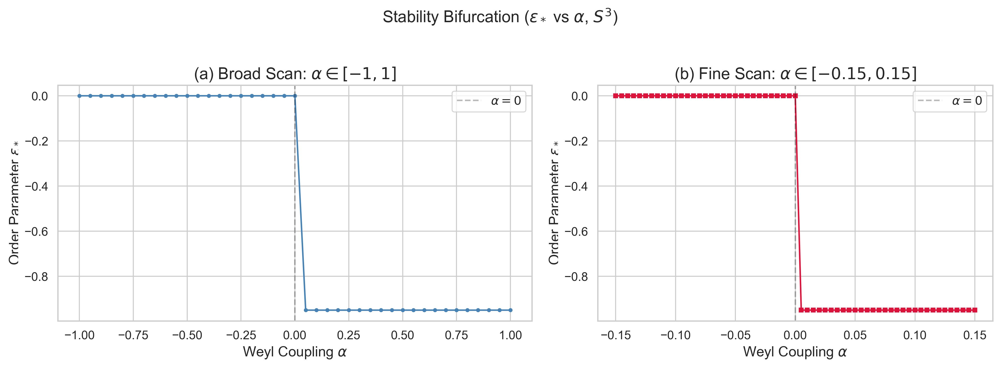
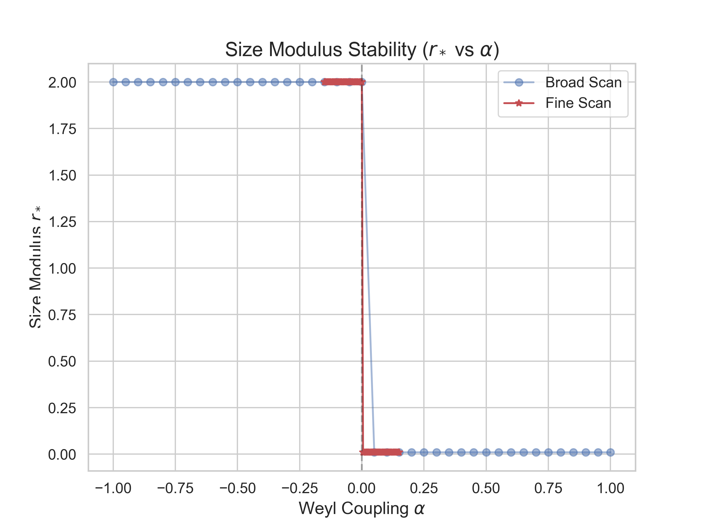

## 5. Stability of the Isotropic Vacuum ($\alpha \leq 0$)

本節では、 $\alpha \leq 0$ の下で $S^3 \times S^1$ の等方真空が Weyl 拡張に対して保護されることを示す。

### 5.1 Theorem 1（等方真空の Weyl 安定性）

> **Theorem 1.** EC+NY+Weyl ラグランジアン
>
> $$\mathcal{L} = \frac{R_{\rm EC}}{2\kappa^2} + \theta_{\rm NY}\, N + \alpha\, C^2$$
>
> の下で、 $S^3 \times S^1$ 上の等方真空（ $\varepsilon = 0$）について以下が成り立つ:
>
> **(a)** 等方 $S^3 \times S^1$ の Weyl スカラーは恒等的にゼロ:
>
> $$C^2(r, \varepsilon = 0) = 0 \qquad (\forall\, r > 0)$$
>
> **(b)** $\alpha \leq 0$ のとき、Weyl 項は有効ポテンシャルの等方極小を補強する（または影響しない）:
>
> $$V_{\rm eff}(r, \varepsilon; \alpha) = V_{\rm EC}(r, \varepsilon) + |\alpha|\, C^2(r, \varepsilon) \cdot \mathrm{Vol}(r)$$
>
> ここで $|\alpha|\, C^2 \cdot \mathrm{Vol} \geq 0$ であり、等号は $\varepsilon = 0$ でのみ成立する。
>
> **(c)** 系として、 $V_{\rm EC}$ が $(r_0, 0)$ で大域的最小を持つならば、 $V_{\rm eff}$ も全 $\alpha \leq 0$ で同一の大域的最小値 $V_{\rm EC}(r_0, 0)$ を同一の最小点 $(r_0, 0)$ で達成する。

### 5.2 証明

#### Part (a) の証明

Lemma 1（§4.2）の式において $\varepsilon = 0$ を代入すると、分子に $\varepsilon^2$ の因子があるため $C^2(r, 0) = 0$。 $\square$

#### Part (b) の証明

$\alpha \leq 0$ とする。 $-\alpha = |\alpha| \geq 0$ であるから:

$$V_{\rm eff}(r, \varepsilon; \alpha) = V_{\rm EC}(r, \varepsilon) + |\alpha|\, C^2(r, \varepsilon) \cdot \mathrm{Vol}(r)$$

Lemma 1 の性質 (ii)（§4.3）より $C^2 \geq 0$。 $\mathrm{Vol}(r) = 2\pi^2 L r^3 > 0$ であるから:

$$|\alpha|\, C^2 \cdot \mathrm{Vol} \geq 0$$

等号は $C^2 = 0$ のとき、すなわち $\varepsilon = 0$ のときのみ成立する（Lemma 1 (ii)）。

したがって:
- $V_{\rm eff}(r, \varepsilon; \alpha) \geq V_{\rm EC}(r, \varepsilon)$ $(\forall\, r, \varepsilon)$
- $V_{\rm eff}(r, 0; \alpha) = V_{\rm EC}(r, 0)$ $(\forall\, r)$

すなわち、Weyl 項は $\varepsilon \neq 0$ の方向にのみ正のペナルティを加え、等方点 $\varepsilon = 0$ には影響しない。 $\square$

#### Part (c) の証明

$V_{\rm EC}$ が点 $(r_0, 0)$ で大域的最小を持つと仮定する:

$$V_{\rm EC}(r_0, 0) \leq V_{\rm EC}(r, \varepsilon) \qquad (\forall\, r, \varepsilon)$$

任意の $(r, \varepsilon)$ に対して:

$$V_{\rm eff}(r, \varepsilon; \alpha) = V_{\rm EC}(r, \varepsilon) + |\alpha|\, C^2 \cdot \mathrm{Vol} \geq V_{\rm EC}(r, \varepsilon) \geq V_{\rm EC}(r_0, 0)$$

一方:

$$V_{\rm eff}(r_0, 0; \alpha) = V_{\rm EC}(r_0, 0) + |\alpha| \cdot 0 \cdot \mathrm{Vol} = V_{\rm EC}(r_0, 0)$$

したがって $(r_0, 0)$ は $V_{\rm eff}$ の大域的最小点であり、最小値は $V_{\rm EC}(r_0, 0)$ に等しい。

さらに、 $V_{\rm EC}$ の最小が狭義（ $(r_0, 0)$ でのみ達成）であれば、 $\varepsilon \neq 0$ の方向には $|\alpha|\, C^2 \cdot \mathrm{Vol} > 0$ が加わるため、 $V_{\rm eff}$ の最小はより厳密に狭義となる。 $\square$

### 5.3 Theorem 1 の前提条件

Theorem 1 (c) の結論は、前提「 $V_{\rm EC}$ が $\varepsilon = 0$ で大域的最小を持つ」に依存する。この前提は:

- **数値的に検証済み**: Stage 2D の数値計算により、参照パラメータ $(V = 4, \eta = -2, \theta_{\rm NY} = 1, \kappa = 1, L = 1)$ において $V_{\rm EC}$ は $(r_0, \varepsilon) = (2.000, 0)$ で探索範囲内の最小値 $V_{\rm min} = -421.103$ を与える。
- **解析的な部分的裏付け**: $V_{\rm EC}$ の $\varepsilon$ 方向 Hessian の正定値性は、少なくとも局所的最小の証明を与える。大域的最小の完全な解析的証明は将来課題として残る。

### 5.4 数値的検証

Theorem 1 の予測と Stage 2D の数値結果を比較する:

| 予測（Theorem 1 から） | 数値結果 | 一致 |
|---|---|---|
| $V_{\rm min}$ は $\alpha \leq 0$ で一定 | 全201点（ $\alpha \in [-1, 1]$）で $-421.103$（11桁一致） | $\checkmark$ |
| $r^*$ は $\alpha$ 非依存 | 全 $\alpha \leq 0$ で $r^* = 2.000 \pm 10^{-7}$ | $\checkmark$ |
| $\varepsilon^*$ は $\alpha$ 非依存 | 全 $\alpha \leq 0$ で $\varepsilon^* \approx 0$（ $10^{-8}$ 精度） | $\checkmark$ |

11桁精度での一致は、定理の正しさを強く支持する数値的証拠である。

### 5.5 分岐図

> **[Fig. 3]** $\varepsilon^*(\alpha)$ 分岐図（ $S^3$）

> **[Fig. 4]** $r^*(\alpha)$ 図（ $S^3$）

### 5.6 物理的解釈: Weyl ペナルティによる等方性の安定化

$\alpha < 0$ の場合、Weyl 項 $|\alpha|\, C^2 \cdot \mathrm{Vol}$ は異方性（ $\varepsilon \neq 0$）に対する**ペナルティ**として機能する。等方点近傍での Weyl ペナルティの大きさは（§4.3 (iii) の Taylor 展開から）:

$$\Delta V_{\rm eff} \approx \frac{16384\pi^2\, |\alpha|\, L}{3r}\,\varepsilon^2$$

$r = r^* = 2$, $L = 1$ のとき:

$$\Delta V_{\rm eff} \approx 26947\, |\alpha|\, \varepsilon^2$$

すなわち、 $|\alpha| = 1$ で小さな異方性 $\varepsilon = 0.01$ に対しても $\Delta V \approx 2.7$ のペナルティが加わる。 $|\alpha|$ が大きいほど等方真空がより深い谷底に位置し、異方性への揺らぎがより強く抑制される。

この安定化メカニズムは、共形的曲率（ $C^2$）を罰則化する $\alpha < 0$ の Weyl 項が、空間の等方性を力学的に保護するという、明快な物理的描像を与える。
