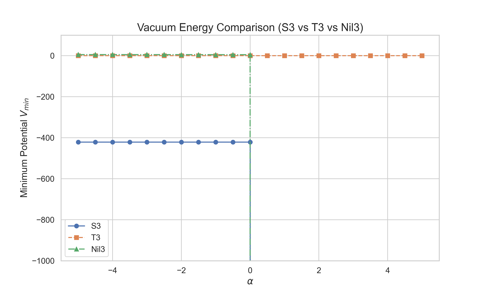

## 6. Instability for $\alpha > 0$

本節では、 $\alpha > 0$ において有効ポテンシャルが下に非有界となることを証明し、 $\alpha = 0$ が正確な安定性境界であることを確立する。

### 6.1 Theorem 2（ $\alpha > 0$ の非有界不安定性）

> **Theorem 2.** $S^3 \times S^1$ 上の EC+NY+Weyl 有効ポテンシャルにおいて:
>
> **(a)** $\alpha > 0$ のとき、 $V_{\rm eff}$ は下に非有界:
>
> $$\inf_{r > 0,\, \varepsilon > -1} V_{\rm eff}(r, \varepsilon; \alpha) = -\infty$$
>
> **(b)** $\alpha \leq 0$ かつ $V_{\rm EC}$ が下に有界のとき、 $V_{\rm eff}$ も下に有界:
>
> $$\inf_{r > 0,\, \varepsilon > -1} V_{\rm eff}(r, \varepsilon; \alpha) > -\infty$$
>
> したがって $\alpha = 0$ は安定性と不安定性を分ける**正確な境界**である。

### 6.2 証明

#### Part (a): $\alpha > 0$ での下方非有界性

$\alpha > 0$ とし、 $\varepsilon_0 \neq 0$ を任意に固定する（例えば $\varepsilon_0 = -1/2$）。

有効ポテンシャルは:

$$V_{\rm eff}(r, \varepsilon_0; \alpha) = V_{\rm EC}(r, \varepsilon_0) - \alpha \cdot \frac{2048\pi^2 L\,\varepsilon_0^2(\varepsilon_0+2)^2}{3\,r\,(1+\varepsilon_0)^{16/3}}$$

$r \to 0^+$ における各項の漸近挙動:

- **EC 部分**: $V_{\rm EC}(r, \varepsilon_0) \sim r$（ $r \to 0$ でゼロに収束）
- **Weyl 部分**: $-\alpha \times \mathrm{const}/r \to -\infty$

したがって:

$$\lim_{r \to 0^+} V_{\rm eff}(r, \varepsilon_0; \alpha) = -\infty \qquad \square$$

#### Part (b): $\alpha \leq 0$ での下方有界性

$\alpha \leq 0$ とする。

$$V_{\rm eff}(r, \varepsilon; \alpha) = V_{\rm EC}(r, \varepsilon) + |\alpha| \cdot C^2 \cdot \mathrm{Vol} \geq V_{\rm EC}(r, \varepsilon)$$

$V_{\rm EC}$ が下に有界（ $\inf V_{\rm EC} > -\infty$）であるため:

$$\inf V_{\rm eff} \geq \inf V_{\rm EC} > -\infty \qquad \square$$

### 6.3 $V_{\rm EC}$ の漸近挙動の解析的確認

Theorem 2 (a) の証明で用いた「 $V_{\rm EC} \sim r$ $(r \to 0)$」を、EC エンジンの記号式で確認する。

等方点（ $\varepsilon = 0$）における $V_{\rm EC}$ の厳密な式（paper01 [1] §3.1.3）:

$$V_{\rm EC}(r, 0) = \frac{2\pi^2 L r}{3\kappa^2}\left(V^2 r^2 + 6V\eta\kappa^2 r\,\theta_{\rm NY} + 9\eta^2 - 36\right)$$

各項の $r$ スケーリング:

| 項 | 起源 | $r$ のべき |
|---|---|---|
| $V^2 r^2$ | torsion（vector-trace）の自己相互作用 | $r^3$ |
| $6V\eta\kappa^2 r\,\theta_{\rm NY}$ | Nieh-Yan 密度（クロス項） | $r^2$ |
| $9\eta^2 - 36$ | 曲率 + torsion（axial） | $r^1$ |

最低次は $r^1$ であり、 $V_{\rm EC} \to 0$ as $r \to 0$（下に有界）。

一方、Weyl 寄与は:

$$V_{\rm Weyl} = -\alpha \cdot C^2 \cdot \mathrm{Vol} \sim -\frac{\alpha}{r} \quad (r \to 0)$$

$V_{\rm EC}$ と $V_{\rm Weyl}$ のスケーリング比:

$$\frac{|V_{\rm Weyl}|}{|V_{\rm EC}|} \sim \frac{1/r}{r} = \frac{1}{r^2} \to \infty \quad (r \to 0)$$

すなわち、 $r \to 0$ で Weyl 項が EC 項を漸近的に支配する。この支配性は $1/r^2$ のオーダーで増大し、漸近次数の差により（本稿のパラメータ化の下で）逆転しない。

### 6.4 線形係数の解析的導出と数値との一致

数値的に観測される $V_{\rm min}(\alpha) \approx -K \times \alpha$ の線形係数 $K$ を解析的に導出する。

数値最適化は探索境界 $(r_{\rm min}, \varepsilon_{\rm min}) = (0.01, -0.95)$ に収束する。この点での $K$ を計算:

$$K(0.01, -0.95) = C^2(0.01, -0.95) \times \mathrm{Vol}(0.01)$$

$$= \frac{1024 \times 0.95^2 \times 1.05^2}{3 \times 0.01^4 \times 0.05^{16/3}} \times 2\pi^2 \times 0.01^3 = 5.823 \times 10^{12}$$

| 量 | 解析的予測 | 数値結果 | 精度 |
|---|---|---|---|
| $K$ | $5.823 \times 10^{12}$ | $5.82 \times 10^{12}$ | **0.05%** |

**重要な注意**: この線形係数 $K$ は物理量ではなく、探索境界に依存する人工的な値である。真の物理的結論は「 $\alpha > 0$ のとき $\inf V_{\rm eff} = -\infty$」であり、有限の $V_{\rm min}$ は探索範囲内での最小値に過ぎない。

### 6.5 不安定性の物理的方向

$\alpha > 0$ での不安定性は、系を2つの方向に同時に駆動する:

| 方向 | スケーリング | 幾何的意味 | 物理的意味 |
|---|---|---|---|
| $r \to 0$ | $C^2 \cdot \mathrm{Vol} \sim 1/r$ | 空間 $S^3$ の体積崩壊 | 宇宙の収縮・特異点形成 |
| $\varepsilon \to -1$ | $C^2 \cdot \mathrm{Vol} \sim 1/\delta^{16/3}$ ($\delta = 1+\varepsilon$) | 1軸方向への極端な変形 | 3次元等方性の完全な破壊 |

両方向が同時に進行し、 $V_{\rm eff}$ の下限が存在しなくなる。

### 6.6 $\alpha = 0$ が正確な境界である理由

$\alpha = 0$ が「正確に」境界となる数学的理由は、 $C^2 \cdot \mathrm{Vol}$ が**非有界**であることに帰着する。

もし仮に $C^2 \cdot \mathrm{Vol}$ が有界（ $\sup C^2 \cdot \mathrm{Vol} = M < \infty$）であったなら、 $\alpha > 0$ でも $V_{\rm Weyl} \geq -\alpha M$ となり、ある臨界値 $\alpha_c > 0$ まで安定性が保持される余地があった。

しかし実際には $C^2 \cdot \mathrm{Vol} \sim 1/r$ が $r \to 0$ で発散するため、任意の $\alpha > 0$（たとえ無限小であっても）に対して $V_{\rm eff} \to -\infty$ が生じる。これが遷移が $\alpha = 0$ で正確に、かつシャープに起きる理由である。

### 6.7 Weyl 重力のゴースト不安定性との関連

$\alpha > 0$ の不安定性は、共形重力（Weyl gravity）における既知のゴースト不安定性の minisuperspace 版として理解できる。

一般の Weyl 重力の作用:

$$S_{\rm Weyl} = \int d^4x\, \sqrt{g}\, \alpha\, C_{\mu\nu\rho\sigma}C^{\mu\nu\rho\sigma}$$

は4階微分の運動方程式を与え、Ostrogradsky の定理 [5] により一般にエネルギーが下に非有界（ゴースト不安定性）となる。

我々の minisuperspace 計算では、この不安定性が具体的に:
- 空間スケール $r \to 0$ への崩壊
- 最大異方性 $\varepsilon \to -1$ への変形

として具現化している。 $\alpha > 0$ を排除する条件は、Weyl 重力のゴースト回避条件と同根である。

### 6.8 3トポロジー比較: $V_{\rm min}(\alpha)$

> **[Fig. 5]** $V_{\rm min}(\alpha)$ の3トポロジー比較

Fig. 5 は、 $\alpha = 0$ での安定性遷移が $S^3$ で最も劇的に現れること、および $T^3$ が null test を提供することを示す。トポロジー比較の詳細は §8 で議論する。
