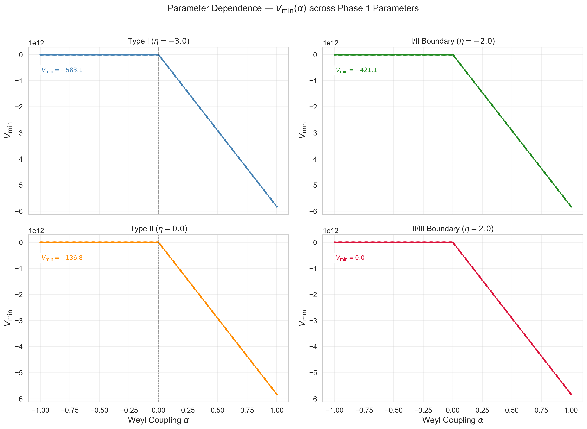

## 7. Universality across paper01 Parameters

本節では、 $\alpha = 0$ の安定性境界が paper01 パラメータ $(V, \eta, \theta_{\rm NY})$ に依存しないことを示し、数値的に検証する。

### 7.1 Theorem 3（安定性境界のパラメータ独立性）

> **Theorem 3.** $V_{\rm EC}$ が下に有界である任意の paper01 パラメータ $(V, \eta, \theta_{\rm NY})$ に対して、 $\alpha = 0$ は安定性境界である。すなわち:
>
> - $\alpha > 0$: $\inf V_{\rm eff} = -\infty$（下に非有界）
> - $\alpha \leq 0$: $\inf V_{\rm eff} > -\infty$（下に有界）
>
> この境界は paper01 パラメータの値に依存しない。

### 7.2 証明: 幾何学的分離

Theorem 3 は Theorem 2 の証明の構造的帰結である。証明の鍵は以下の2つの性質にある:

#### (i) 幾何学的分離（Geometric Decoupling）

Weyl スカラー $C^2(r, \varepsilon)$ は Levi-Civita 接続のみから計算される純粋に幾何学的な量であり、paper01 パラメータ $(V, \eta, \theta_{\rm NY})$ に依存しない。

$$C^2(r, \varepsilon) = \frac{1024\,\varepsilon^2(\varepsilon+2)^2}{3\,r^4\,(1+\varepsilon)^{16/3}}$$

この式には torsion パラメータ $\eta$, $V$ も、Nieh-Yan 結合定数 $\theta_{\rm NY}$ も、重力結合定数 $\kappa$ も現れない。 $C^2$ は $(r, \varepsilon)$ のみの関数である。

#### (ii) 漸近的支配（Asymptotic Dominance）

$r \to 0$ における Weyl 項と EC 項のスケーリング比較:

- $V_{\rm EC}(r, \varepsilon) \sim r$（ $r \to 0$, $\varepsilon$ 固定）——paper01 パラメータに依存する係数を持つが、 $r$ のべきは $r^1$ で本稿の ansatz の下では一貫
- $V_{\rm Weyl} = -\alpha \cdot C^2 \cdot \mathrm{Vol} \sim -\alpha/r$（ $r \to 0$, $\varepsilon \neq 0$ 固定）——paper01 パラメータに非依存

したがって:

$$\frac{|V_{\rm Weyl}|}{|V_{\rm EC}|} \sim \frac{1}{r^2} \to \infty \quad (r \to 0)$$

この発散は paper01 パラメータの値によらない。

#### 証明の完成

- **Theorem 2 Part (a)** の証明は $V_{\rm EC}$ の具体的な形（すなわち paper01 パラメータ）に依存しない。 $C^2 \cdot \mathrm{Vol} \sim 1/r$ の発散が幾何的に保証されるため、任意の $\alpha > 0$ に対して $V_{\rm eff} \to -\infty$。
- **Theorem 2 Part (b)** は $V_{\rm EC}$ が下に有界であることのみを要求し、その具体的な下限値には依存しない。

したがって、「 $V_{\rm EC}$ が安定真空を持つ」（= paper01 の Type I または Type II に分類される）という条件の下で、 $\alpha = 0$ の安定性境界は paper01 パラメータによらず成立する。 $\square$

### 7.3 数値的検証:

Theorem 3 のパラメータ独立性を、paper01 パラメータ空間の代表的な4点で数値的に検証した。全てのケースで $V = 4, \theta_{\rm NY} = 1, \kappa = 1, L = 1$ を固定し、 $\eta$ を変化させて paper01 の異なる相を横断する。

| パラメータセット | $\eta$ | paper01 分類 | $V_{\rm min}$ ($\alpha \leq 0$) | $r^*$ | $\alpha = 0$ 境界 |
|---|---|---|---|---|---|
| Type I 中心 | $-3.0$ | Type I | $-583$ | $2.65$ | Sharp |
| I/II 境界 | $-2.0$ | 境界 | $-421$ | $2.00$ | Sharp |
| Type II 中心 | $0.0$ | Type II | $-137$ | $0.87$ | Sharp |
| II/III 境界 | $2.0$ | 限界 | $+0.03$ | $0.01$ | Sharp |

#### 7.3.1 Type I（ $\eta = -3.0$）

$\alpha \leq 0$ で $V_{\rm min} \approx -583$, $r^* \approx 2.65$ に深い安定真空が存在。 $\alpha > 0$ で直ちに不安定化。paper01 で最も安定な真空に対しても、Weyl 不安定性は $\alpha > 0$ で容赦なく作用する。

#### 7.3.2 I/II 境界（ $\eta = -2.0$）

参照パラメータセット。§5-6 の詳細な解析と整合。

#### 7.3.3 Type II（ $\eta = 0.0$）

$\alpha \leq 0$ において、 $r^* \approx 0.866$ に明確な安定真空（ $V_{\rm min} \approx -137$）が存在する。paper01 の Type II（障壁なし rolling）に分類されるパラメータでも、 $\alpha = 0$ でシャープな安定性境界が観測される。

Type II での安定真空の存在は物理的に注目に値する: $\eta = 0$ は軸性 torsion がゼロの場合に対応し、ベクトル torsion $V$ と Nieh-Yan 結合 $\theta_{\rm NY}$ のみで安定真空が形成されることを意味する。

#### 7.3.4 II/III 境界（ $\eta = 2.0$）

$\alpha \leq 0$ で $V_{\rm min} \approx +0.03$（正値）、 $r^*$ が探索下限に張り付き。paper01 の Type III（安定真空なし）への遷移の近傍にあり、Theorem 3 の前提条件「 $V_{\rm EC}$ が下に有界で安定真空を持つ」がぎりぎり成立している状況。それにもかかわらず、 $\alpha = 0$ でのシャープな遷移は観測される。

### 7.4 パラメータ独立性の視覚的証拠

> **[Fig. 6]** パラメータ依存性: 4パラメータセットの $V_{\rm min}(\alpha)$

Fig. 6 は Theorem 3 のパラメータ独立性の直接的な視覚的証拠である。paper01 パラメータ空間の端から端まで（Type I 中心から II/III 境界まで）、 $\alpha = 0$ が分岐点として機能する。

### 7.5 パラメータ独立性の物理的解釈

$\alpha = 0$ 境界のパラメータ独立性は、以下の構造的事実に起因する:

1. **Weyl テンソルは「形」の量**: $C^2$ は多様体の共形構造（ $r, \varepsilon$）のみに依存し、トーション振幅・NY 結合定数 ( $V, \eta, \theta_{\rm NY}$ ) には依存しない。
2. **有効ポテンシャルの $\alpha$ 線形性**: $V_{\rm eff} = V_{\rm EC} - \alpha \cdot C^2 \cdot \mathrm{Vol}$ は $\alpha$ に関して厳密に線形であり、 $\alpha$ の臨界値は $V_{\rm EC}$ と $C^2 \cdot \mathrm{Vol}$ の有界/非有界の性質のみで決まる。
3. **$C^2 \cdot \mathrm{Vol}$ の非有界性**: $C^2 \cdot \mathrm{Vol} \sim 1/r$ の発散は paper01 パラメータと無関係な幾何学的性質である。

この3つの事実から、 $\alpha = 0$ の安定性境界は paper01 パラメータの調整によっては移動しない。

