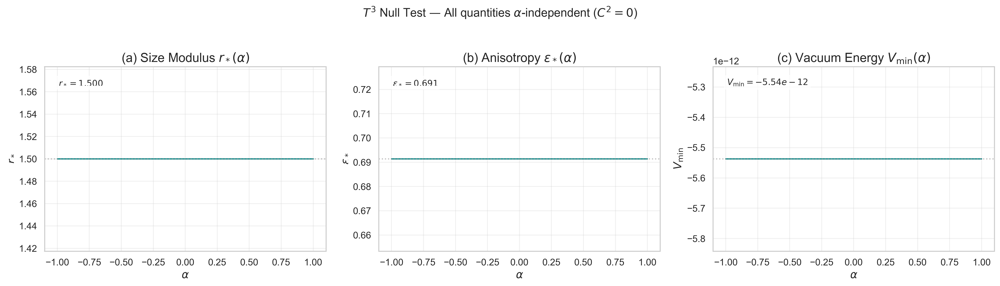

## 8. Topology Comparison under Weyl Extension

本節では、paper01 のトポロジー選択原理（ $S^3$ の優位性）が Weyl 拡張の下でも保存されることを確認する。3つのトポロジー（ $S^3$, $T^3$, $Nil^3$）の振る舞いを系統的に比較し、 $T^3$ の null test による計算エンジンの検証を行う。

### 8.1 $\alpha \leq 0$ での比較: $S^3$ の優位性は保存

$\alpha \leq 0$ において、3つのトポロジーの最低エネルギー真空を比較する:

| トポロジー | $V_{\rm min}$ | $r^*$ | $\varepsilon^*$ | 物理的状態 |
|---|---|---|---|---|
| $S^3$ | $-421$ | $2.000$ | $0$ | 深い安定真空（最低エネルギー） |
| $T^3$ | $\approx 0$ ($5.5 \times 10^{-12}$) | $1.500$ | $-0.642$ | 事実上平坦 |
| $Nil^3$ | $> 0$（ $\approx 5$, flat 極限漸近値） | $1.500$ | $\to \infty$（flat 極限） | エネルギー的に不利 |

$S^3$ は $V_{\rm min} = -421$ で顕著に最低エネルギーを達成しており、paper01 のトポロジー選択原理が Weyl 拡張下でも保存される。

Theorem 1 により、 $S^3$ の $V_{\rm min}$ は $\alpha \leq 0$ の全域で一定（ $\alpha$ 非依存）である。 $T^3$ も $V_{\rm min} \approx 0$ で $\alpha$ 非依存（後述の null test で確認）である。 $Nil^3$ は $\varepsilon \to \infty$（フラット極限）に漸近し、漸近 $V_{\rm min} \approx 5$ で $\alpha$ 弱依存である（Appendix B.4 参照）。

### 8.2 $\alpha > 0$ での比較: 優位性の概念の消失

$\alpha > 0$ では状況が質的に変化する:

| トポロジー | $V_{\rm min}(\alpha > 0)$ | 挙動 |
|---|---|---|
| $S^3$ | $\to -\infty$（線形発散） | 不安定（ $r \to 0$, $\varepsilon \to -1$ への崩壊） |
| $T^3$ | $\approx 0$（ $\alpha$ 非依存） | 安定だが $V_{\rm min} \approx 0$（ $C^2 = 0$ のため Weyl 項がゼロ） |
| $Nil^3$ | $\to -\infty$（ $S^3$ より遅い発散） | 不安定 |

$S^3$ と $Nil^3$ はともに $V_{\rm eff} \to -\infty$ となり不安定である。 $T^3$ は安定を保つが $V_{\rm min} \approx 0$ であり、深い安定真空を形成しない。したがって $\alpha > 0$ では「トポロジー選択」の概念自体が意味を持たない——どのトポロジーも物理的に viable な安定真空を提供しない。

### 8.3 $T^3$ Null Test

$T^3 \times S^1$ は全ての $\alpha$ で null test を提供する。 $T^3$ は平坦であり $C^2 = 0$ であるため、Weyl 項 $\alpha C^2$ はゼロとなり、有効ポテンシャルに $\alpha$ 依存性は現れないはずである。

#### 数値的検証

全201点（ $\alpha \in [-1, 1]$, ステップ0.01）で以下を確認:

| 量 | 値 | $\alpha$ 依存性 |
|---|---|---|
| $r^*$ | $1.500$ | 全点で一致 |
| $\varepsilon^*$ | $-0.642$ | 全点で一致 |
| $V_{\rm min}$ | $5.54 \times 10^{-12}$ | 全点で一致（機械精度） |

$V_{\rm eff}$ の差 $\max|V_{\rm eff}(\alpha) - V_{\rm eff}(0)| = 0.00$（機械精度で一致）。

この null test は2つの意味で重要である:

1. **計算エンジンの検証**: $\alpha$ 実装が正しいことの厳格なテスト。 $C^2 = 0$ のトポロジーで Weyl 項が正確にゼロになることを確認。
2. **理論の整合性**: $T^3$ の平坦性と Weyl 項の共形不変性が正しく連携していることの確認。

> **[Fig. 7]** $T^3$ null test の可視化

#### $T^3$ の $\varepsilon^* \neq 0$ について

$\varepsilon^* \approx -0.642$ は等方ではない変形を示唆するが、 $V_{\rm min} \approx 0$ であるため、ポテンシャル地形が極めて平坦であり、この「最小値」の物理的意味は限定的である。等方からの変形に対するエネルギーコストがほぼゼロということであり、 $T^3$ の構造的な柔軟性を反映していると考えられる。

### 8.4 $Nil^3$ の挙動: フラット極限への漸近

$Nil^3$ は他の2つのトポロジーとは質的に異なる振る舞いを示す。 $Nil^3$ の平坦極限への漸近挙動を正確に捉えるため、 $\varepsilon \in [-0.95, 5.0]$ の範囲で探索を行った結果（Appendix B.4）、以下が判明した:

- **有限 $\varepsilon^*$ での大域最小が存在しない**: 固定 $\varepsilon$ ごとに $V_{\rm eff}(r)$ は $r$ 方向の極小（ $T^3$ 的プロファイル）を持つが、その最小値 $V_{\rm min}(\varepsilon) \equiv \min_r V_{\rm eff}(r, \varepsilon)$ は $\varepsilon$ に対して単調減少であり、有限 $\varepsilon$ での内部極小は存在しない。 $\varepsilon \to \infty$ でフラット極限（ $T^3$ 的挙動）に漸近する。
- **漸近 $V_{\rm min} \approx 5 > 0$**: $\alpha$ 弱依存。 $S^3$（ $V_{\rm min} = -421$）に対してエネルギー的に不利。
- **物理的解釈**: $Nil^3$ の構造定数は squashing 因子 $(1+\varepsilon)^{-4/3}$ を含み、 $\varepsilon \to \infty$ で消失する。 $Nil^3$ の有効ポテンシャルは Heisenberg 群構造に由来する曲率コスト（ $C^2 > 0$）を最小化するために、構造定数をゼロに近づける方向を選好する。

この結果は、共形的にフラットな配位（ $C^2 = 0$）がエネルギー的に有利であるという本論文の主題と整合する。 $S^3$ は $\varepsilon = 0$ で厳密に $C^2 = 0$ を達成するのに対し、 $Nil^3$ は $\varepsilon \to \infty$ の極限でのみ $C^2 \to 0$ に漸近する。すなわち、 $S^3$ は**有限の変形**（ $\varepsilon = 0$）で厳密に共形的平坦性を達成し自然に安定化するのに対し、 $Nil^3$ は**無限大の変形**（ $\varepsilon \to \infty$）を要さなければ $C^2 \to 0$ に到達できないという、本質的な幾何学的非対称性がある。

$\alpha = 0$ の安定性境界が $Nil^3$ でも $S^3$, $T^3$ と同様に成立することは、高解像度スキャンにより確認されている（Appendix B.5）。

### 8.5 3トポロジー比較サマリー

> **[Table 1]** 3トポロジー比較サマリー（ $\alpha \leq 0$ 代表値）

| 量 | $S^3$ | $T^3$ | $Nil^3$ |
|---|---|---|---|
| $V_{\rm min}$ | $-421$ | $\approx 0$ | $\approx 5$（flat 極限漸近値） |
| $r^*$ | $2.000$ | $1.500$ | $1.500$ |
| $\varepsilon^*$ | $0$ | $-0.642$ | $\to \infty$（flat 極限） |
| $C^2(\varepsilon^*)$ | $0$ | $0$ | $\to 0$（漸近的に消失） |
| $\alpha$ 依存性 | なし（Thm 1） | なし（ $C^2 = 0$） | 弱依存 |
| paper01 優位性 | **最低エネルギー** | 中立 | 不利 |
| Weyl 拡張下の優位性 | **保存** | 変化なし | 有限 $\varepsilon^*$ での大域最小なし（flat 極限へ漸近） |

$S^3$ のトポロジー優位性は Weyl 拡張下でも保存される。 $S^3$ は $\varepsilon^* = 0$ で厳密に $C^2 = 0$ を達成し安定な真空を形成するのに対し、 $Nil^3$ は有限 $\varepsilon^*$ での大域最小を持たず、 $\varepsilon \to \infty$ の極限でのみフラット極限に漸近する。 $T^3$ は $C^2 = 0$ により Weyl 項の影響を受けないが $V_{\rm min} \approx 0$ である。

特異点 $\varepsilon=-1$ を超えた数学的な根 $\varepsilon=-2$ については、物理的到達不能であるため本稿では議論から除外する。
なお、 $T^3$ は全域で恒等的に $C^2=0$ であり、 $Nil^3$ は $\varepsilon \to \infty$ の漸近極限でのみ $C^2 \to 0$ となるため、 $\varepsilon<-1$ の領域に $C^2=0$ の有限の根を持つのは $S^3$ のパラメータ表現上の特質である。

