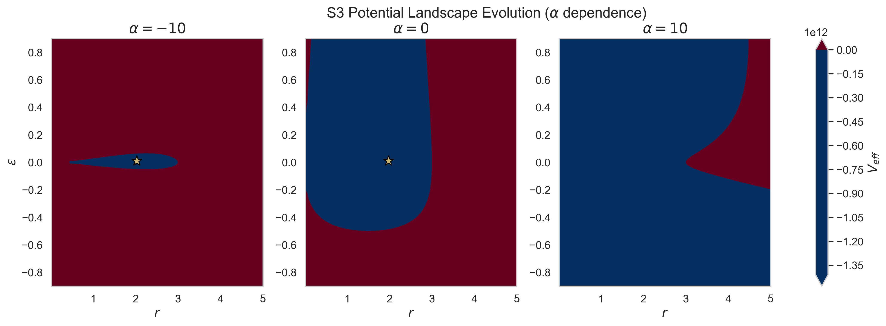

# DPPUv2 paper02: Structural Robustness of Isotropic S³ Vacua in Einstein-Cartan Minisuperspace via Chiral Equilibrium and Weyl Stability

[日本語 README](README_ja.md)




## Paper Contents

- [Official PDF (English, built from LaTeX)](DPPUv2-paper02.pdf)
- [Draft in Japanese Markdown](DPPUv2-paper02_sec01.md)

## Directory Structure

- `LaTeX/` — LaTeX manuscript and compiled PDF
  - `main.tex` — Main file
  - `sections/` — TeX files for each section
  - `appendices/` — TeX files for appendices
  - `figures/` — Figures
- `data/` — Data files for the paper
- `script/` — Data processing and visualization scripts
  - For script details, see [script/README](script/README.md)

## Building the LaTeX PDF

### Basic Build Command

Navigate to the LaTeX directory and run pdflatex.
**At least two compilation passes are required** to resolve cross-references (`\ref`, `\label`, etc.) correctly.

- **First pass**: writes label information to the `.aux` file
- **Second pass**: reads and resolves references from the `.aux` file

If references appear as `??`, run the compilation once more.

```bash
cd LaTeX
pdflatex -interaction=nonstopmode main.tex
pdflatex -interaction=nonstopmode main.tex
```

### Output Files

A successful build produces:

- `main.pdf` — Final PDF file (approx. 3.5 MB, 79 pages)
- `main.aux` — Auxiliary file (cross-reference data)
- `main.log` — Compilation log
- `main.out` — hyperref outline information

### Troubleshooting

#### On Error

Check the log file:
```bash
grep -i "error\|warning" main.log | tail -20
```

#### Clean Build

Delete all auxiliary files and rebuild from scratch:
```bash
cd LaTeX
rm -f *.aux *.log *.out *.synctex.gz *.fdb_latexmk *.fls
pdflatex -interaction=nonstopmode main.tex
pdflatex -interaction=nonstopmode main.tex
```

## Author

Muacca

## License

See the LICENSE file in the repository root.
